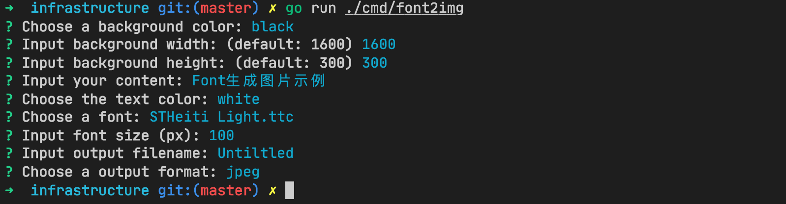

# font2img

Providing intreactive prompts to help people who want to post blog but could not draw picture as blog banner. So using the blog-title as the banner maybe be a good idea. However I could not found the property tool for me (a developer)..., why not recreating one with personal ideas ?

it has following features:

[x] font to img (basic feature)
[x] image format suport multi types(jpeg, png)
[x] background config support
[x] custom font choosing
[x] font config support (color, size, bold, etc)
[ ] more color settings 
[ ] background with image

## Get Started

#### 1. to run



#### 2. get result


## Core Code

generate a background image with sigle color, then draw text with specified font on the backgroud image.

#### 1. text draw method

```go
func (t *text) draw(dst *image.RGBA) (err error) {
	// log.Infof("text=%v", *t)
	var (
		fontByts []byte
	)
	fontByts, err = ioutil.ReadFile(t.FontFamily)
	if err != nil {
		log.Error(err)
		return
	}
	// parse font file
	font, err := freetype.ParseFont(fontByts)
	if err != nil {
		log.Error(err)
		return
	}

	ctx := freetype.NewContext()
	ctx.SetDPI(float64(t.DPI))
	ctx.SetFont(font)
	ctx.SetFontSize(float64(t.Size))
	ctx.SetClip(dst.Bounds())
	ctx.SetDst(dst)                                         // background image setting here
	ctx.SetSrc(image.NewUniform(t.color))                   // font color setting
	ctx.DrawString(t.Content, freetype.Pt(t.X, t.Y+t.Size)) // set text position

	return nil
}
```

#### 2. background draw method

```go
func (bg *background) draw(dst *image.RGBA) error {
	col := image.NewUniform(bg.color)
	draw.Draw(dst, dst.Bounds(), col, image.ZP, draw.Src)
	return nil
}
```

## Dependency

* https://github.com/AlecAivazis/survey/v2 interactive command line interface
* https://github.com/golang/freetype font support